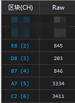
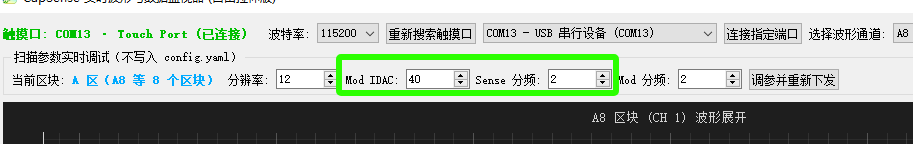
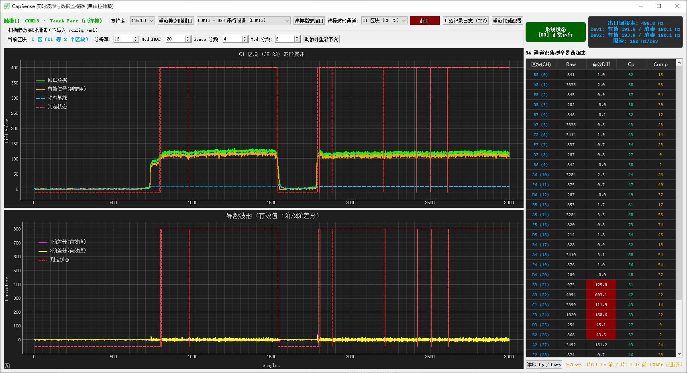

# 主控配置

自制手台用，成品买家无需查看

如果有异常一般插拔一下即可解决。

---

[手动更新主控固件](..\stm32_updata\old_firmware\README.md)

## 基础配置（必须先完成）

1. 下载群文件内`3.0v工具包`

2. 打开`tools\set_com_ports`，打开之后运行一键配置端口，然后重新插拔手台，关闭软件。 <br> 如果你有自己的读卡器，你应该先拔出读卡器，然后再运行软件，接着手动手台的将com1改成其他端口，然后再连接读卡器。

3. 打开`tools\touch-mapping-tool`, 按`M`键将软件切换到合适的显示器，然后按`R` <br> 然后依次点击区块，全部点击完成之后观察上方提示，没有重复即可关闭软件，有的话请你检查是你点错了还是你的接线有问题

然后打开游戏游玩即可。

## 配置io

获得更低的按键延迟

1. 将 `\melonloader-mod` 的 `.dll` 文件放入游戏的mods文件夹即可。 <br> 无需额外配置

## 调试简介

1. 打开 `touchhost-kaede` 文件夹 的exe程序(注意: 如果你要移动这个exe的话记得一起移动文件夹内的其他文件) <br> 调试器会自行连接手台

2. 检查raw值， 正常来讲raw列应该满足下面要求，偏差不大就可以接受 <br> 
    ```
    A区 : 3195 - 3400
    B区 : 799 - 850
    C区 : 3195 - 3400
    D区 : 200 - 212
    E区 : 799 - 850
    ```

     太大了说明走线太长, 太小了的话检查线是不是断了... <br> 

3. 灵敏度的调整一般使用这两个值  
    MOD IDAC属于感度，越小灵敏度越高(反比) <br> 
    sense负责区块的充电时间，一般无需更改。必须可以被 mod分频整 <br> 其他参数不建议修改。

4. 绿色的线条代表raw的变化量， 橙色的代表基线处理之后的raw值，代码判定使用橙色的线条。

## 基础调试

1. 首先右上角选择需要调整的区块，例如C1这些携带区块引出的 <br>

2. 将手快速！！按压覆盖C区引出，注意不要按到区块了，然后你就可以看到图像。<br> 分析图象，目前出现了引出触发 <br> 这个时候应该增大MOD IDAC。每次增加2直到难以出现引出触发。 <br> 其他区块同理。