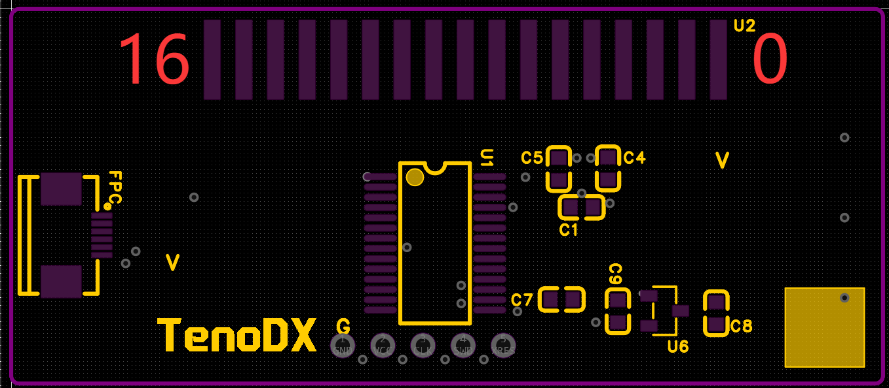
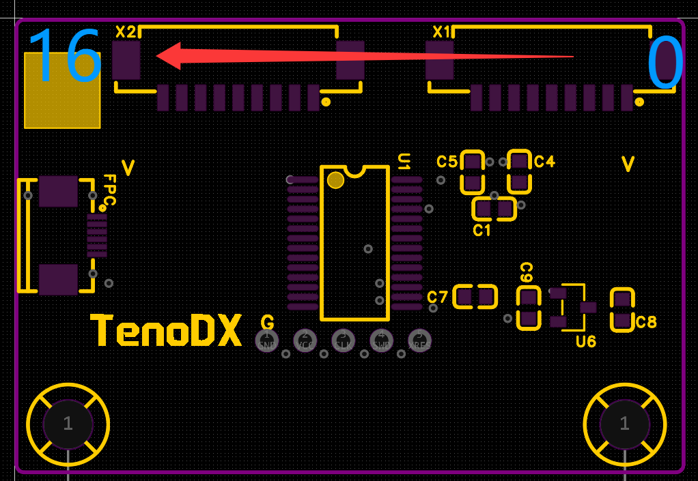

# 触摸传感器简介

## 基本要素
- 触摸屏硬件使用`2`块`CY8C4025AZI-S413`搭建, 通过`I2C`协议通讯
- 每个触摸板负责`17`个区块，平分区域类型
- 左右看，在主控一侧的称为`touch0`, 另一片则是`touch1`
- touch0/1分别占据I2C通道的`0x08`与`0x09`

## 信息

此方向为正向，对于单个触摸的焊盘/引脚编号，始终从右到左递增  
主控板接收到来自`touch1`的数据时会将其引脚编号进行`(i += 17)`处理,
因此在它们正好可以首位相连形成一个`0-33`引脚的圆

