# Psoc 更新固件


## 触摸板简介
 - 触摸板分为两片，分称为`Touch-0`与`Touch-1`  
 - 从手台的背面分左右看，靠近主控的一侧为`Touch-0`  
 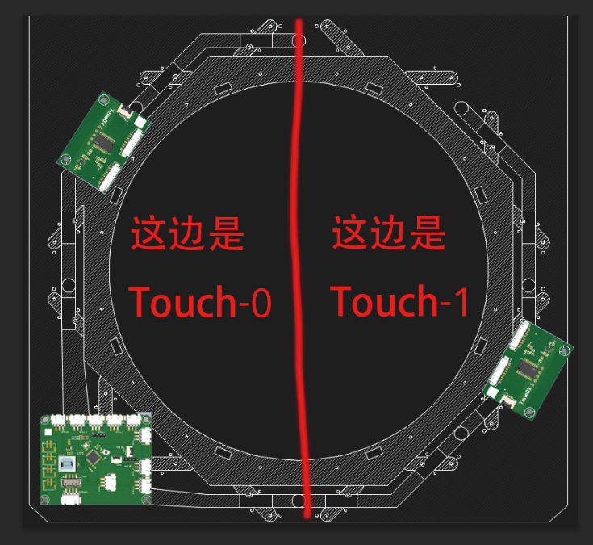
 - 芯片上面有5个并排的孔位，标注了G的意为`GND`（接地） <br> 我们只需要用的绿色框内的四个孔  
 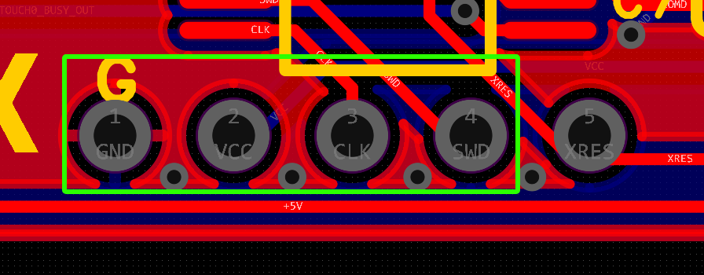
 - 初代PCB这个位置是GND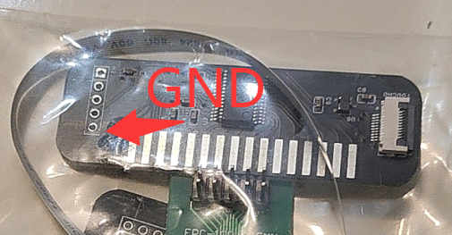


## 烧录器操作方法
1. 拿出探针，在边边一个针脚做个标记，代表这是GND引脚 <br> 防止之后的操作接反探针导致芯片损坏。<br> 然后另外三根按顺序标注信息
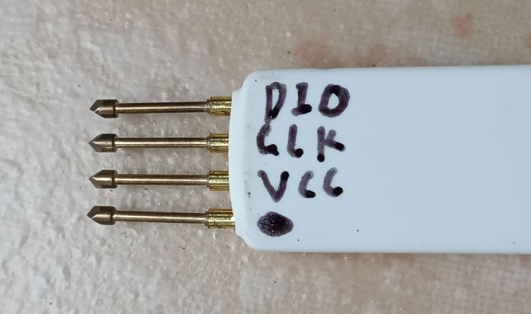
2. 调整线材，拿出探针包装包含的线材，然后看视频教程将其中一头的段子全部退出 `https://www.bilibili.com/video/BV1fE421V72y`

3. 看着J-link和探针的标识，将线找准位置插入 <br> 注意探针接口是有方向的，只能一个方向插。
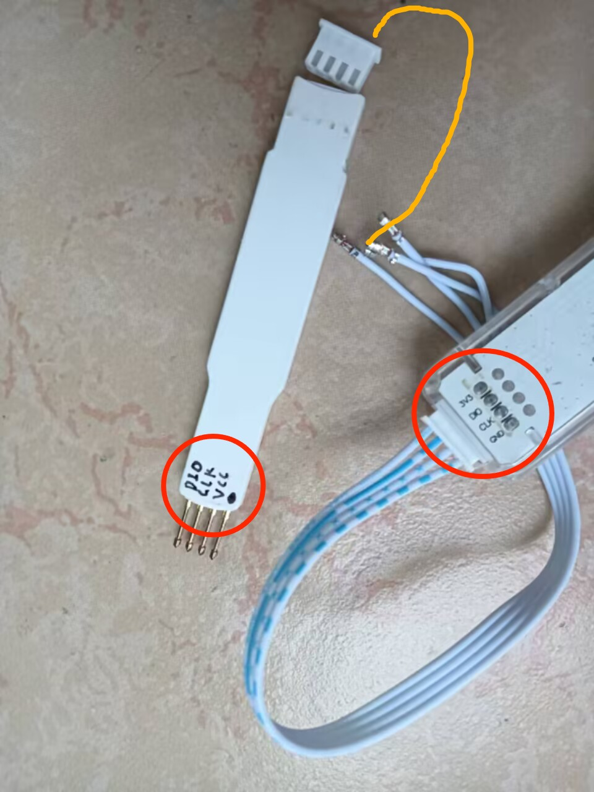


4. 最后再次检查是否有接错!!!! 你也不想手台冒烟吧？？？？

## 软件配置

1. 下载群文件内的 `JLink_Windows_V630.exe` 安装 

2. 插上j-link

3. 下方搜索打开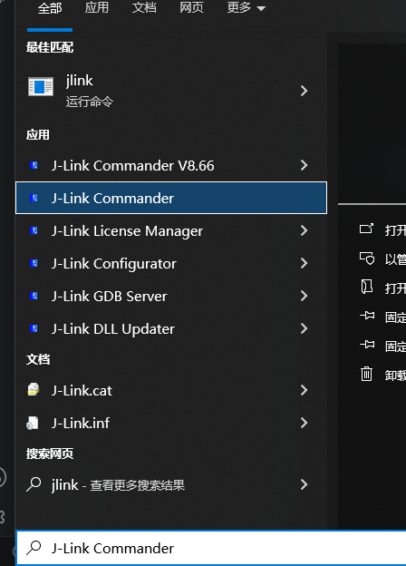

4. 输入下面文本发送 (感谢Qhin的[烧录教程](https://affinelab.notion.site/p/1b863a5ea44180b29971c819414261ac?pvs=25))
    ```
    Exec SetSN=12345678     
    Exec AddFeature GDB
    Exec AddFeature RDI
    Exec AddFeature FlashB
    Exec AddFeature FlashDL
    Exec AddFeature JFlash
    Exec AddFeature RDDI
    ```
    拔出j-link，重启J-Link Commander再插入j-link提示ok字样即可.
    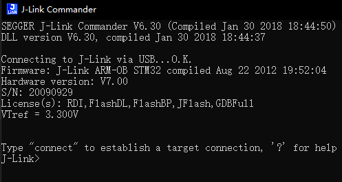
    然后关闭它。

5. 打开j-flash  
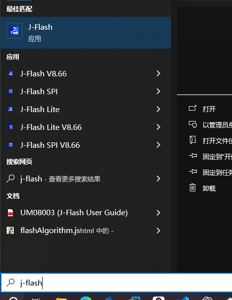
按着图片操作  
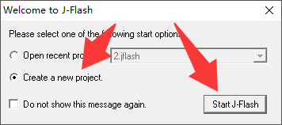  
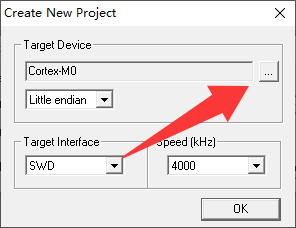
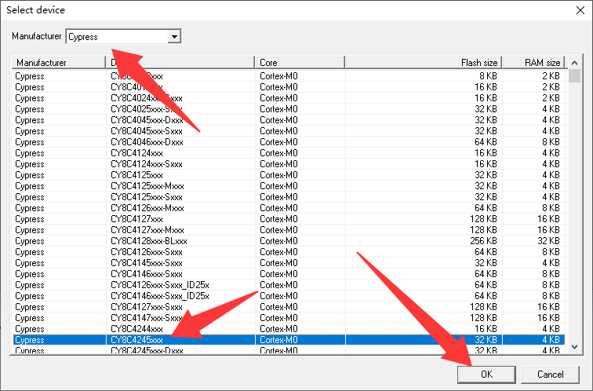
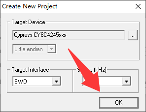
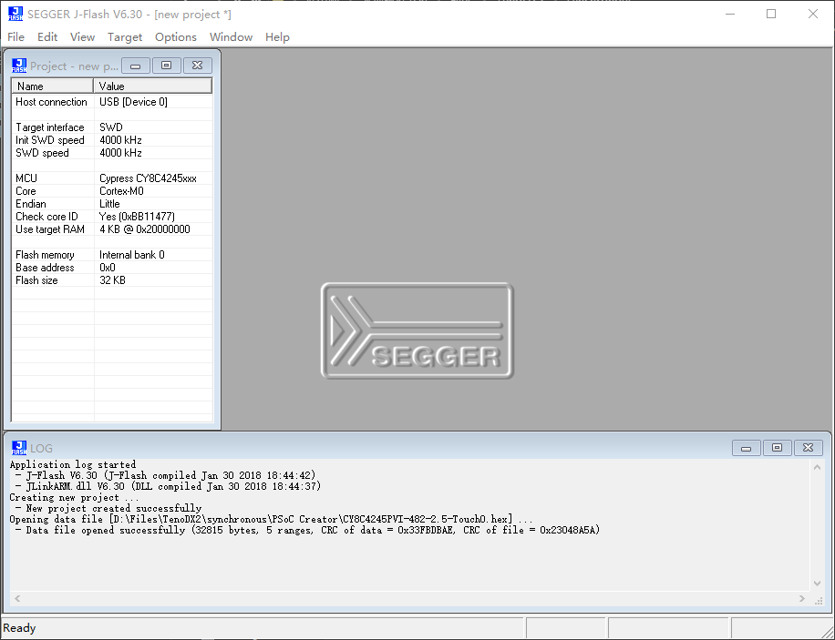

6. 加载固件  
下载群文件的2.5版本含有jlink标识的固件
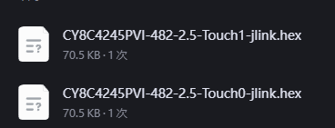  
按快捷键`Ctrl + O`或者软件右上角的File菜单的第一个Open data file  
选择你刚刚下载的固件打开，注意区分0/1。靠近主控一侧的为0
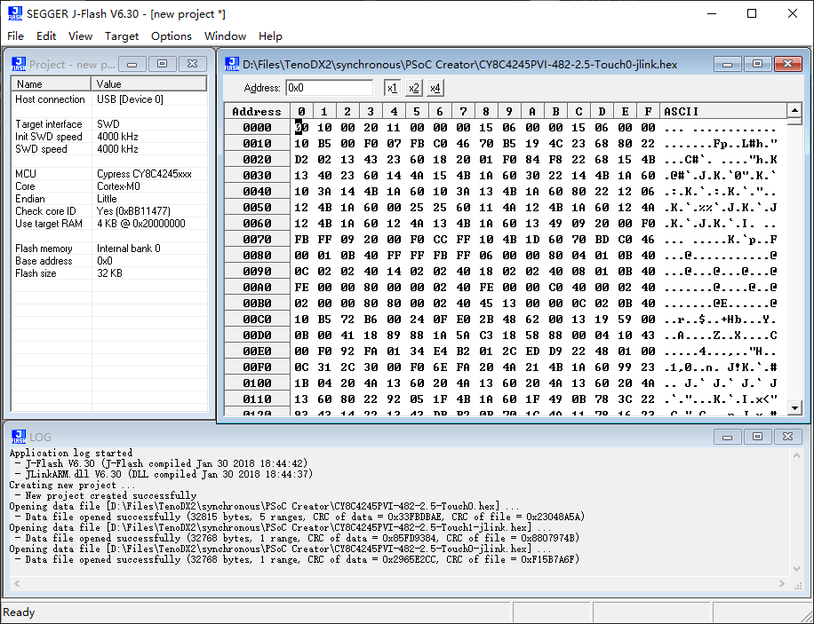

7. 连接触摸板 
将探针插入触摸板，注意方向！！！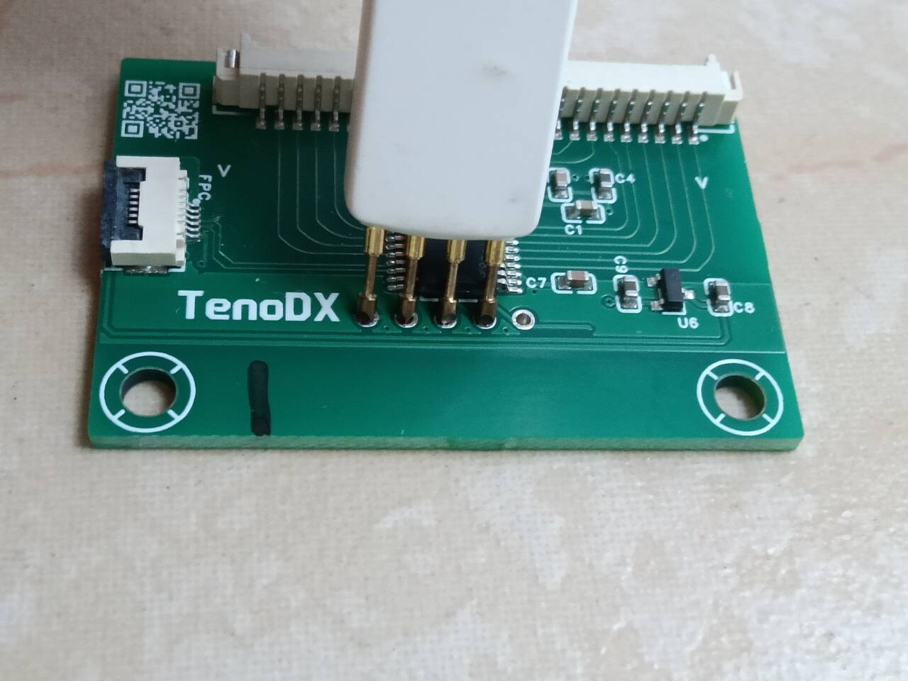
点击连接
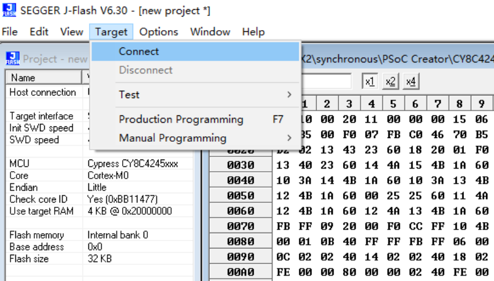  
连接成功，如果出现错误请你检查连接！！！
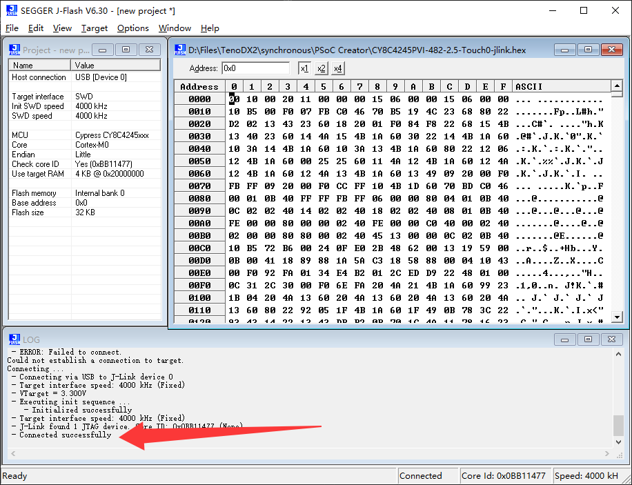

8. 烧录  
先清空芯片数据
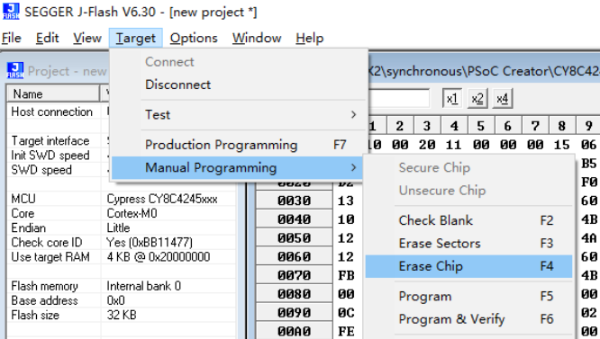  
烧入固件
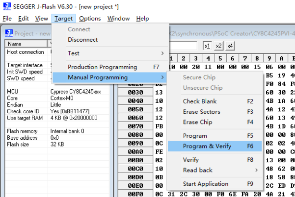
烧录成功  
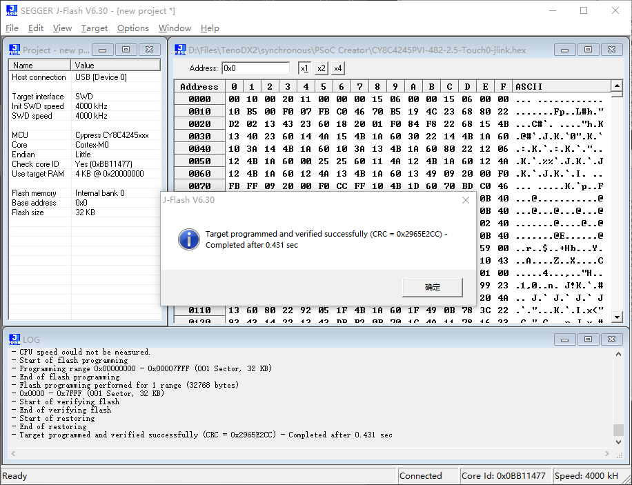

9. 换另一个触摸板，加载另一份固件然后安装步骤八再次烧录 