# 旧固件更新方式

[← 返回 STM32 固件更新](../README.md)

## 注意事项

插拔一定要完全断电(主控不亮灯才是断电)

## 更新

### 进入BL

给主控断电，按着主控上面的小按钮，然后插电，接着松开按钮

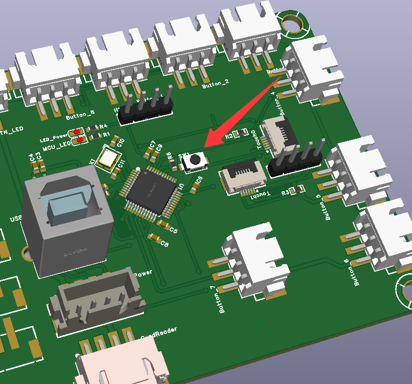

### 启动更新器

1. 在售后群下`SetupSTM32CubeProgrammer_win64.exe`安装  
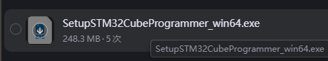  
2. 打开更新器  
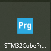  
3. 下载新固件  
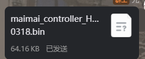  
点加号，然后选择新固件
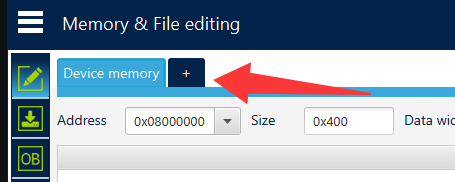
4. 按照图示操作(要先进BL)
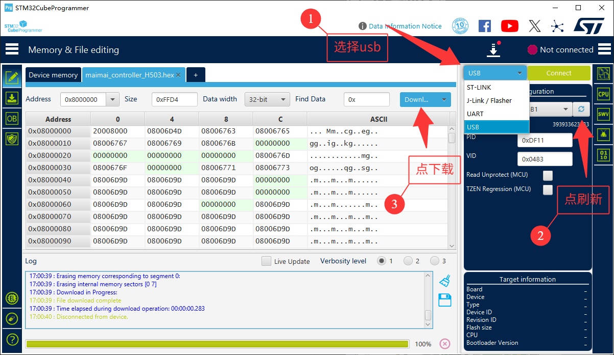

完成图中步骤之后插拔主控，看到主控有LED闪烁即为更新成功

---

### 配置主控

1. 群内下载配置工具  
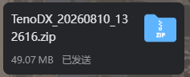  
2. 解压出内容，选择TenoDXConfig打开  
3. 软件内选择有Aime标识的串口连接
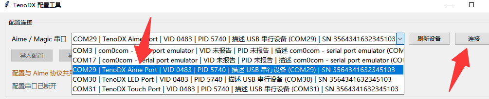
4. 更改数据格式
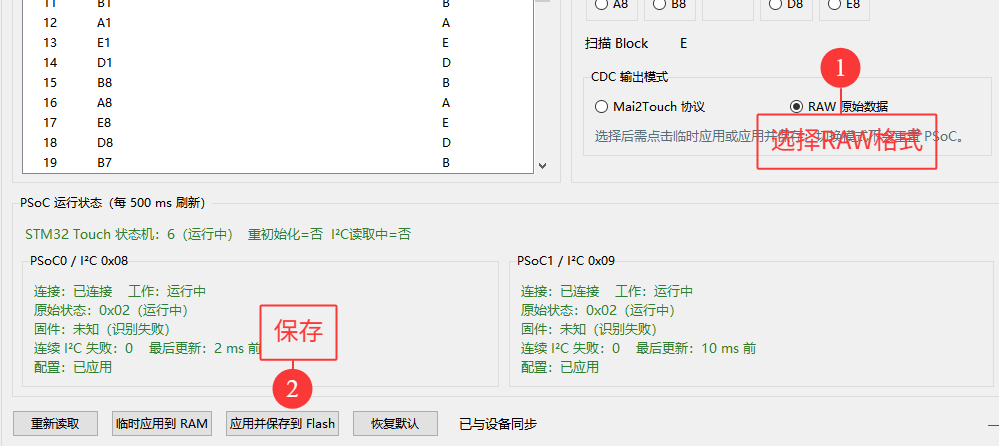
5. 打开mcm，控制器输入，找到映射, 记住内容
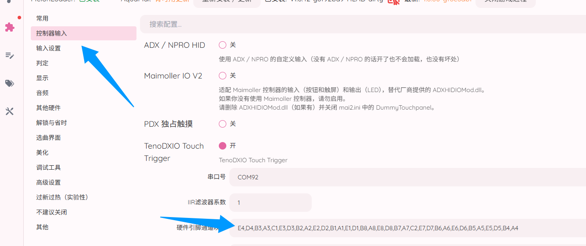  
打开配置工具，按着mcm里面的映射，按循序配置然后保存， 重新插拔即可(如果不一样)。  
例如我的映射数据是`E4, B4, D3....`, 那么就选择通道0，右边选E4;通道1，右边选B4;通道2，右边选D3...
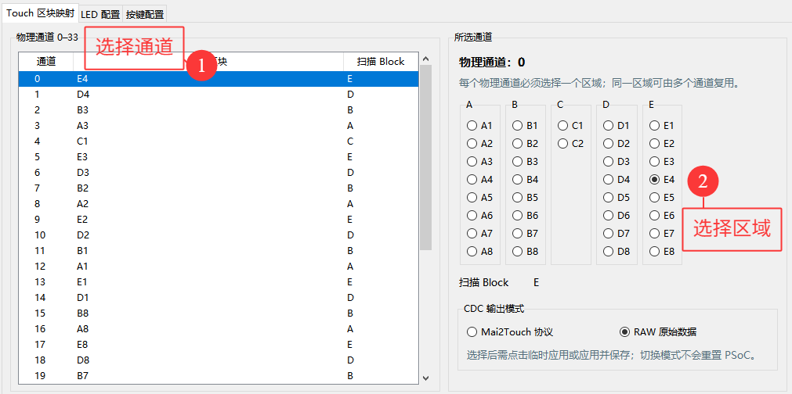

### 游戏配置，打开mcm
打开mcm，控制器输入，注意串口号和配置工具显示touch的要一样
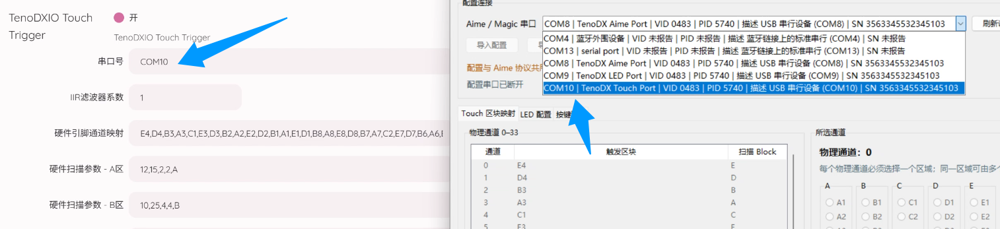